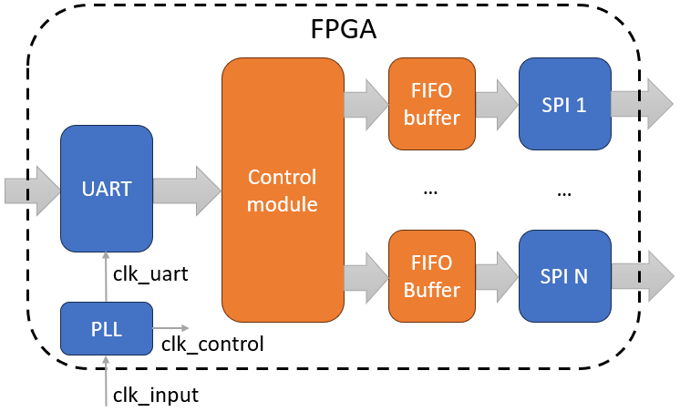
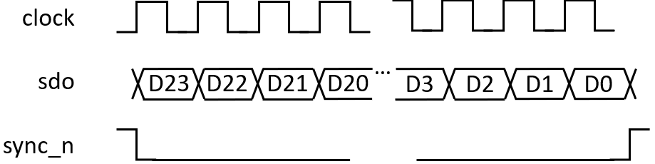
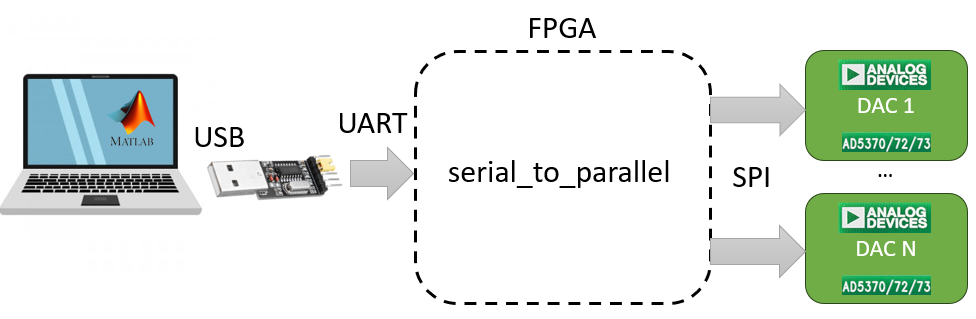

# Serial to parralel converter
This project contains a Serial to Parallel Converter (SPC) module that was designed to control several ADI Digital to Analog Converters (DAC) simultaneously.

## Motivation
There are not so many applications where independent control over more than 50 different voltages could be required. The need to manage a large number of independent voltages came from antenna array measurements. Analog-controlled antenna arrays usually consist of a bunch of equal antenna unit cells, each of which has a control element. For example, it can be a simple 1-bit phase shifter designed with a PIN diode or varactor diode. For research purposes, it is common to change the voltage on each element independently. In a scenario where the antenna array has 10x10 elements, the number of required independent voltages comes to 100. DACs with so many channels are expensive and rare ICs. That is why combining multiple DACs is a pretty in-demand task. For this purpose, the SPC module was written. At the same time, FPGAs are a pretty common element of communication systems and are used to control wireless transceivers. Thus, integration of the antenna array control logic in FPGA firmware will simplify and reduce the complexity of the system.

## GENERAL DESCRIPTION
The SPC module is a serial UART to multiple SPI device interface, which simplifies serial to parallel designs. It has been designed to operate efficiently with an external USB-to-serial UART controller for further connection of multiple devices to the computer. The structure of the SPC module is shown below. It consists of the UART receiver, control module, FIFO buffers, and SPI transmitters. The number of SPI transmitters is equal to the number of required control devices (in this case, DACs). Analog Devices AD537x were considered controlled devices in my current project as they have up to 40 channels and easy buy-in evaluation boards, which significantly simplify prototyping of the designed control system. The module has all the required pins to control the DACs, which are used to settle the voltage or reset device registers.

### UART interface
The UART module receives asynchronous serial-to-parallel conversion of the data from the external hardware. It receives 8 bits of serial data: one start bit, one stop bit, and no parity bit. UART baudrate is parametrized and defined as the relationship between the UART module frequency and clock cycles per bit.

### PLL module
The PLL module performs a transformation of the input FPGA frequency and provides the required frequencies for the UART module and other logic.

### FIFO module
Data sent from the computer via the UART interface is stored in the FIFO buffers. The length of the stored word is 24 bits, which is equal to the length of the SPI receiving register in the DAC. The depth of the module is 32 words, which is equal to the number of output channels of the DAC. Data are moved from the buffer to the SPI transmit register during the SPI transmission.

### SPI interface
The SPI of the SPC module allows the user to configure the DAC device with different functions or operations via a 4-pin SPI port. The SPI consists of three control lines: clock, sdo, and sync_n. The figure below shows the SPI write timing diagram. 

SPI data transmission consists of 24 data bits and no parity bit. The write-cycle sampling must be performed on the falling edge of the clock. 

### Control module
The Control module handles the transfer of data between the UART module receive register and SPI FIFO. It fully controls SPI data transmission and also provides the required control signals to assist with the control of connected DACs.

## THEORY OF OPERATION
The SPC module is fully controlled via the UART interface. The module has one register that controls the internal state machine. This register fills with the first received byte from the UART transmission. The command system is pretty simple and is described in the table below.

### Commands
`8’bx001aaaa` - receive word and store it in FIFO for further SPI transmission. The last four bits of the command define the DAC number. This command must follow with three additional bytes that will be further transmitted via SPI.

`8’bx010xxxx` - starts SPI transmission. All SPI transmitters will transmit until all FIFOs are empty.

`8’bx011xxxx` - command switches the n_LDAC output for one clock cycle. It tells the DACs to update output voltages according to the last received SPI data.

## HOW TO USE
SPC module followed with all modules required for its operation. The `main` module combines all them together and allows you to change parameters, which are defined in the hardware setup after the compilation cycle. The PLL module is required to set the frequency of the UART module, and the rest of the SPC module should be designed separately. The frequency of the UART module `clk_uart` should be equal to or smaller than the frequency of the other control logic `clk_control`. A typical application for the SPC module is shown in the figure below.

### Pin Description

| Pin| Direction | Active level | Description |
| --- | --- | --- | --- |
| clk | input | - | Main clock frequency of the FPGA |
| reset_button | input | low | Show file differences that haven't been staged |
| on_led | output | low | Turns on when firmware is downloaded in FPGA |
| fifo_empty_led_and | output | low | Turns on when all FIFO are not empty |
| fifo_empty_led_or | output | low | Turns on when some FIFO is not empty |
| uart_rx | input | - | Input of the UART receiver |
| uart_tx | output | - | Output of the UART transmitter |
| dac_busy_n | input | low | Active when DAC performs internal calculations |
| dac_sdo | output | - | Output of the SPI transmitter |
| dac_sclk | output | - | Clock signal for SPI transmision |
| dac_sync_n | output | low | Activates SPI receiver in the device connected to the SPI transmitter |
| dac_reset_n | output | low | On the rising edge of reset, the DAC state machine initiates a reset sequence to reset the internal registers |
| dac_clr_n | output | low | When this pin is low, the input to each of the DAC output buffer is switched to the externally set potential on the SIGGNDx pin |
| dac_ldac_n | output | low | The DAC outputs are updated by taking the this pin low |
